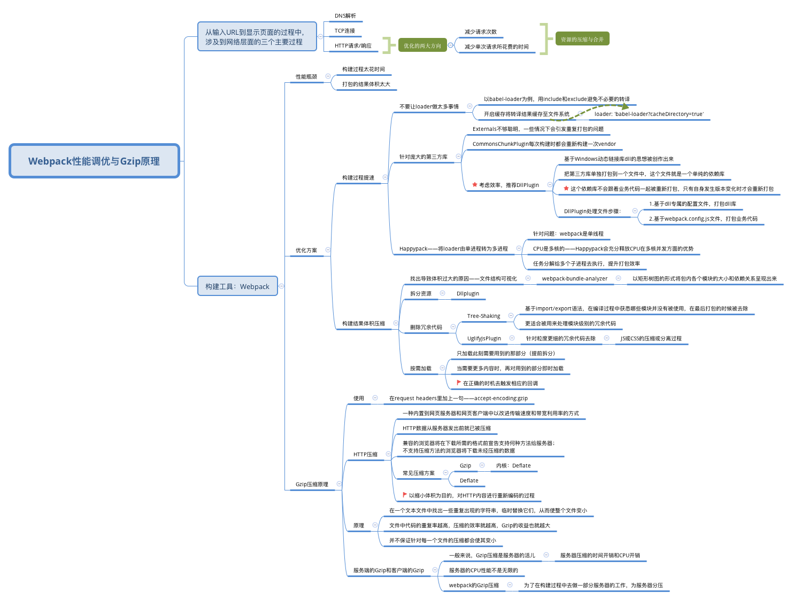

## 网络篇1：Webpack性能调优与Gzip原理



### Webpack性能瓶颈

* webpack的构建过程太花时间
* webpack打包的结果体积太大


### Webpack优化方案

* 构建过程提速

  * 不要让loader做太多事情——以babel-loader为例

    1. **最常见的优化方式：**使用include/exclude，限定文件范围

    ```javascript
    module: {
      rules: [
        {
          test: /\.js$/,
          exclude: /(node_modules|bower_components)/,
          use: {
            loader: 'babel-loader',
            options: {
              presets: ['@babel/preset-env']
            }
          }
        }
      ]
    }
    ```

    2. 开启缓存将转译结果缓存至文件系统。为loader增加响应的参数设定

    ```javascript
    loader: 'babel-loader?cacheDirectory=true'
    ```

  * 针对庞大的第三方库

    使用一些类似UglifyJsPlugin的webpack插件会被庞大的第三方库拖累

    在vue项目中使用例子：

    1. 编写基于dll专属的配置文件

       ```javascript
       // webpack.dll.conf.js
       
       const path = require('path');
       const webpack = require('webpack');
       
       module.exports = {
       	entry: {
           // 依赖的库数组
           vendor: [
             'vue',
             'vue-router/dist/vue-router.esm.js',
             'vuex/dist/vuex.esm.js',
             'axios',
             'vant',
             'vue-template-compiler',
             'qs',
             'eslint-plugin-vue',
             'less'
           ]
         },
         output: {
           path: path.join(__dirname, 'public/vendor'),
           filename: '[name].dll.js',
           library: '[name]_[hash]', // vendor.dll.js 中暴露出的全局变量名
         },
         plugins: [
           new webpack.DllPlugin({
             name: '[name]_[hash]', // 需要和library保持一致
             path: path.join(__dirname, 'public/vendor', '[name]-manifest.json'),
             context: process.cwd()
           })
         ]
       }
       ```

    2. 运行npm script，生成dll库

       ```json
       {
         "scripts": {
           "dll": "webpack -p --progress --config ./webpack.dll.conf.js"
         }
       }
       ```

       vendor.dll.js: 第三方库打包的结果

       vendor-manifest.json: 用于描述每个第三方库对应的具体路径

    3. 基于webpack.config.js文件，打包业务代码

       ```javascript
       // vue.config.js
       
       module.exports = {
         configureWebpack: {
           externals: {},
           plugins: [
             new webpack.DllReferencePlugin({
               context: process.cwd(),
               manifest: require('./public/vendor/vendor-manifest.json')
             })
           ]
         }
       }
       ```
       
    4. 页面引用dll.js

       ```html
       <script src="./vendor/vendor.dll.js"></script>
       ```

  * Happypack——将loader单进程转为多进程

    webpack是单线程的，多个任务只能排队一个接一个地等待处理 => CPU是多核的，HappyPack会充分释放CPU在多核并发方面的优势。

    使用方法：把对loader的配置转移到HappyPack中。可以手动告诉HappyPack我们需要多少的并发进程

    ```javascript
    const HappyPack = require('happypack');
    // 手动创建进程池
    const happyThreadPool = HappyPack.ThreadPool({ size: os.cpus().length });
    
    module.exports = {
      module: {
        rules: [
          {
            test: /\.js$/,
            loader: 'happypack/loader?id=happyBabel', // 问号后面的查询参数指定了处理这类文件的HappyPack实例的名字
          }
        ]
      },
      plugins: [
        new HappyPack({
          id: 'happyBabel', // 这个HappyPack实例的名字就叫做happyBabel，和上面的查询参数呼应
          threadPool: happyThreadPool, // 指定进程池
          loaders: ['babel-loader?cacheDirectory']
        })
      ],
    }
    ```

    

* 构建结果体积压缩

  * 找出导致体积过大的原因，文件结果可视化

    [webpack-bundle-analyzer](https://www.npmjs.com/package/webpack-bundle-analyzer): 以矩阵树图的形式将包内各个模块的大小和依赖关系呈现出来

  * 拆分资源

    DllPlugin

  * 删除冗余代码

    Tree-Shaking（webpack2）， ES6模块，针对模块级别的冗余代码

    UglifyJsPlugin等针对JS或CSS的压缩或分离，粒度更细的冗余代码去除，如console、注释等

  * 按需加载

    ```javascript
    require.ensure(dependencies, callback chunckNames); // webpack提出的的解决异步依赖的一个方法，非标准方法，传统的回调
    ```

    Code-Splitting：React-Router4

    ecmascript定义的动态import，esm标准语法，会返回一个Promise

### Gzip压缩原理

动态gzip

静态资源gzip压缩 xx.js -> xx.js.gz


#### 评论扩展

多线程打包，parallel

减少请求资源体积与请求个数、缩短单个访问时间，HTTP2、浏览器并发下载资源、预加载etc。

Tree-Shaking：ParallelUglifyPlugin

