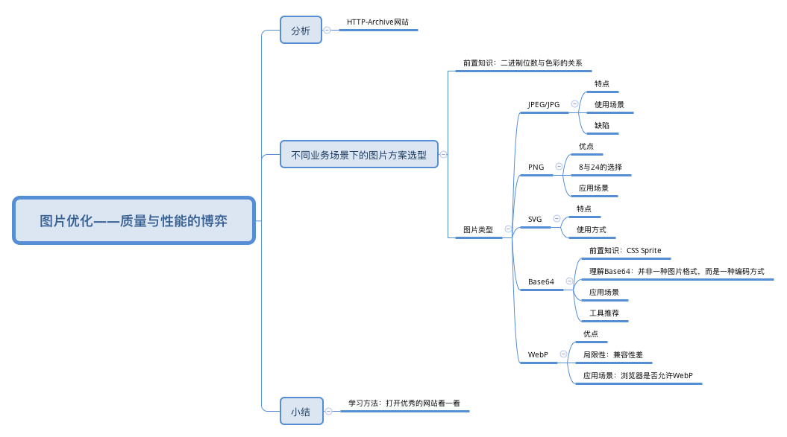

## 网络篇2：图片优化——质量与性能的博弈

“权衡”——压缩图片的体积/选取图片体积较小的格式——以牺牲一部分成像质量为代价——寻求一个性能与质量之间的平衡点




### 分析

[HTTP-Archive](https://httparchive.org/reports/page-weight#bytesTotal)：此网站定期抓取Web上的站点，并记录资源的加载情况、Web API的使用情况等页面的详细信息，并会对这些数据进行处理和分析以确定趋势。


### 不同业务场景下的图片方案选型

较为广泛的Web图片格式有：JPEG/JPG, PNG, WebP, Base64, SVG等

雪碧图(CSS Sprites)

#### 前置知识：二进制位数与色彩的关系

在计算机中，像素用二进制数来表示。不同的图片格式，像素与二进制位数之间的对应关系是不同的。

一个像素对应的二进制位数越多，它可以表示的颜色种类就越多，成像效果就越细腻，文件体积相应会更大。

一个二进制位表示两种颜色（0|1 对应 黑|白），如果一种图片格式对应的二进制位数有n个，它就可以表示2^n种颜色。

* JPEG/JPG

  关键字：有损压缩、体积小、加载快、不支持透明度

  * 优点

    JPEG/JPG最大特点：有损压缩=》非常轻巧的图片格式。

    虽然是有损压缩，但仍然是一种高质量的压缩方式。以24位存储单个图，可以呈现多达1600万种颜色，足以应对大多数场景下对色彩的要求，压缩前后的质量损耗并不容易被人眼察觉——用对业务场景的前提下。

  * 使用场景

    适用于呈**现色彩丰富的图片**，大的背景图、轮播图或Banner 图等。质量还可以、体积也不会太大。

  * 缺陷

    处理矢量图形或Logo等线条感较强、颜色对比强烈的图像时，人为压缩导致的图片模糊会相当明显。

    另外，不支持透明度处理。

* PNG-8与PNG-24

  关键字：无损压缩、体积大、质量高、支持透明

  * 优点

    PNG（可移植网络图形格式Portable Network Graphics）：一种无损压缩的高保真的图片格式。8和24对应二进制数的位数，8位最多支持256种颜色，24位可呈现约1600万种颜色。

    **比JPG有更强的色彩表现力，对线条的处理更细腻，对透明度有良好的支持。唯一不足就是体积太大。**

  * 8与24的选择

    当追求最佳的显示效果，并且不在意文件体积大小时，推荐使用PNG-24。

    通常为了规避体积问题，一般不用PNG去处理较复杂的图片。遇到合适PNG的场景时，通常优先选择更小巧的PNG-8。

    如何确定？较好的做法是，把图片先按照这两种格式分别输出，看PNG-8输出的结果是否存在肉眼可见的质量损耗，并且确认这种损耗是否在可接受的范围，基于对比的结果去判断。

  * 应用场景

    考虑PNG在处理线条与颜色对比度方面的优势，主要用它来呈现小的Logo、颜色简单且对比强烈的图片或背景等。

* SVG

  关键字：文本文件、体积小、不失真、兼容性好

  SVG（可缩放矢量图形）是一种基于XML语法的图像格式。

  特点：**对图像的处理不是基于像素点，而是基于对图像的形状描述。**

  * 特性

    与JPG和PNG相比，文件体积更小、可压缩性更强。

    最显著优势：图片可无限放大而不失真（矢量图）。1张SVG足以适配n种分辨率。

    SVG是文本文件，可以像写代码一样定义SVG，把它写在HTML里成为DOM的一部分，也可以把对图形的描述写入以.svg为后缀的独立文件（使用方式与其他图形文件无异）。这使得SVG文件可以被非常多的工具读取和修改，**有较强的灵活性。**

    **局限性**主要两方面：一、渲染成本比较高，对性能不利；二、存在其他图片格式所没有的学习成本（可编程）。

  * 使用方式与应用场景

    写在HTML里：

    ```html
    <body>
      <svg xmlns="http://www.w3.org/2000/svg" width="200" height="200">
      	<circle cx="50" cy="50" r="50"></circle>
      </svg> 
    </body>
    ```

    将SVG写入单独的文件引入HTML：

    ```html
    
    ```

    [在线矢量图形库](http://www.iconfont.cn/)

    **简单图形**=》复杂的图形时

* Base64

  关键字：文本文件、依赖编码、小图标解决方案

  并非一种图片格式，而是一种编码方式。和雪碧图一样，是作为小图标解决方案而存在的。

  * 前置知识：最经典的小图标解决方案——雪碧图（CSS Sprites）

    一种将小图标和背景图像合并到一张图片上，然后利用CSS的背景定位来显示其中一部分的技术。

    优点：单独一张图片的所需的HTTP请求更少，对内存和带宽更友好。

    Base64也是为了减少加载网页图片时对服务器的请求次数，从而提升网页性能。Base64是作为雪碧图的补充而存在的。

  * 理解Base64

    每次加载图片，都需要单独向服务器请求这个图片对应的资源，也就意味着一次HTTP请求的开销。

    **Base64是一种用于传输8Bit字节码的编码方式，通过对图片进行Base64编码，可以直接将编码结果写入HTML或CSS，从而减少HTTP请求的次数。**

  * 应用场景

    Base64编码后，图片大小会膨胀为原文件的4/3（由Base64的编码原理决定）。因此大图编码到HTML或CSS中，后者的体积会明显增加，即使请求减少了，也无法弥补庞大的体积带来的性能开销。

    而小图编码带来的文件体积膨胀、以及浏览器解码Base64带来的时间开销，与节省掉的HTTP请求开销相比，可以忽略不计。

    一张图片在满足以下条件时可对它应用Base64编码：

    1 实际尺寸很小 10kb？

    2 无法以雪碧图的形式与其他小图结合

    3 更新频率非常低（不需要重复编码和修改文件内容，维护成本较低）

  * Base64编码工具推荐

    利用webpack来进行Base64的编码——webpack的[url-loader](https://github.com/webpack-contrib/url-loader)，除了具备基本Base64的编码功能，还可结合文件大小，判断是否有必要进行Base64编码。

    其他在线编解码服务。

* WebP

  像JPEG一样对细节丰富的图片信手沾来，像PNG一样支持透明，像GIF一样可显示动态图片。

  与PNG相比，无损图像的尺寸更小，在等效的质量指数下，有损图像的体积更小；无损WebP支持透明度，对于有损RGB压缩可接受的情况下，有损WebP也支持透明度。

  * 局限性

    太年轻=》兼容性问题

    另外，还会增加服务器的负担——和编码JPG文件相比，编码同质量的WebP文件会占用更多的计算资源。

  * 应用场景

    浏览器是否支持WebP。

    一旦选择了WebP，就要考虑不兼容的情况，准备降级方案。（进行兼容性的预判，根据浏览器型号、以及该型号是否支持WebP格式来决定当前浏览器显示的是.webp后缀还是.jpg后缀）

    一个维护性更强、更加灵活的方案——把判断工作交给后端，由服务器根据HTTP请求头部的Accept字段来决定返回什么格式的图片。当包含image/webp时，就返回WebP格式的图片。

    **如果决定使用WebP，兼容性处理必不可少。**

  


### 小结

学习方法：打开优秀的网站看一看（淘宝、京东等电商平台对图片的使用非常多）


#### 评论补充

http2的多路复用 =》 雪碧图

在压缩图片体积的同时尽量保持质量。在不同的情况选择不同的图片格式

使用oss服务器上的图片可在图片后面加w、h，直接在获取图片时就限制大小

动图：gif（体积小、兼容性好，黑色背景会有明显齿轮）、apng（没有齿轮）