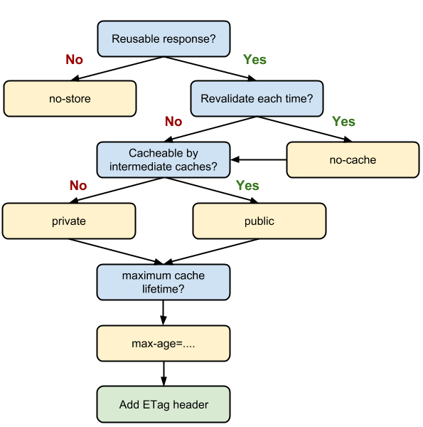

## 存储篇1：浏览器缓存机制介绍与缓存策略剖析

缓存：**减少网络IO消耗，提高访问速度。**浏览器缓存是一种操作简单、效果显著的前端性能优化手段。（！）（用户体验、服务器负担、节省带宽）

通过网络获取内容既速度缓慢又开销大，较大的响应需要在客户端与浏览器之间进行多次往返通信，这会延迟浏览器获得和处理内容的时间，还会增加访问者的流量费用。=》缓存并重复利用之前获取的资源

浏览器缓存机制的四个方面，按照获取资源时请求的优先级排序如下：

* Memory Cache
* Service Worker Cache
* HTTP Cache（即Cache-Control、expires等字段控制的缓存）
* Push Cache（HTTP2的新特性）

开发者工具Network面板：

size一栏描述如from xxx，即对应的资源从缓存获取


### HTTP缓存机制探秘

强缓存优先级较高，在命中强缓存失败的情况下，才会走协商缓存

* 强缓存（优先级较高）

  **特征：**利用http头中的expires(HTTP/1.0)和cache-control(HTTP/1.1)两个字段来控制

  当请求再次发出时，浏览器会根据其中的expires和cache-control判断目标资源是否命中强缓存，**若命中，则直接从缓存中获取资源，不再与服务端发生通信。**

  **命中强缓存的情况下，返回的HTTP状态码为200。**

  * 强缓存的实现：从expires到cache-control

    expires是一个时间戳，当我们试图再次从服务器请求资源，浏览器就会先对比本地时间和expires的时间戳，如果小于expires设定的过期时间，就直接从缓存中获取资源。

  * expires最大的问题：对本地时间的依赖。=》客户端与服务端的时间设置不同，或者客户端时间被手动改掉。

    =》HTTP1.1增加了Cache-Control：expires的完全替代方案（继续使用expires唯一目的是为了向下兼容）

    🌰：

    ```
    cache-control:max-age=31536000
    ```

    `max-age`：控制资源的有效期（不是一个时间戳，而是一个时间长度，规避了时间戳带来的问题）（相对时间=》规避时差问题）

    客户端会记录请求到资源的时间点，以此作为相对时间的起点，确保参与计算的两个时间节点（起点时时间和当前时间）都来源于客户端

    cache-control的优先级比expires高，同时出现时，以cache-control为准

  * cache-control应用分析

    * s-maxage与max-age

      s-maxage优先级高于max-age，如果s-maxage未过期，则向代理服务器请求其缓存内容。（场景：依赖各种代理的大型架构中，考虑代理服务器的缓存问题。）s-maxage用于表示cache服务器（如cache CDN）的缓存的有效时间的，并只对public缓存有效。

      **s-maxage仅在代理服务器中生效**，客户端中我们只考虑max-age

    * public与private

      public与private是**针对资源是否能够被代理服务器缓存**而存在的一组对立概念

      public：既能被浏览器缓存，也能被代理服务器缓存

      private：只能被浏览器缓存。**private为默认值**。

      ```
      cache-control:max-age=3600,s-maxage=31536000
      ```

      如果设置了s-maxage，没设置public，CDN还可以缓存这个资源。因为明确的缓存信息（例如“max-age”）已表示响应是可以缓存的。

    * no-store与no-cache

      **no-store: 不使用任何缓存策略**。*`在no-cache的基础上`*，服务端的缓存确认也绕开，只允许直接向服务端发起请求、并下载完整的响应。

      no-cache: 绕开浏览器，每一次发起请求不再去询问浏览器的缓存情况，而是直接向服务端去确认该资源是否过期（即走协商缓存的路线）

* 协商缓存

  依赖于服务端与浏览器之间的通信。

  浏览器需要向服务器去询问缓存的相关信息，进而判断是重新发起请求、下载完整的响应，还是从本地获取缓存的资源。

  如果服务端提示缓存资源未改动（Not Modified），资源会被重定向到浏览器缓存，**这种情况下网络请求对应的状态码是304**。

  * 协商缓存的实现：从Last-Modified到Etag

    Last-Modified是一个时间戳，如果我们开启了协商缓存，它会在首次请求时随着response headers返回。

    ```
    Last-Modified:
    ```

    随后我们每次请求时，会带上一个叫If-Modified-Since的时间戳字段，这正是之前response返回的Last-Modified的值。

    ```
    If-Modified-Since:
    ```

    服务器收到该字段后，会对比该时间戳和资源在服务器上的最后修改时间是否一致，从而判断资源是否发生了变化。

    如果发生变化=》会返回一个完整的响应内容，并在response headers中添加新的Last-Modified值

    如果没有变化=》会返回一个304的响应，response headers里不再添加Last-Modified字段

    * 常见弊端场景：

      1 编辑了文件，但文件的内容没有变化——不该重新请求的时候，也重新请求了

      2 修改文件的速度过快，由于If-Modified-Since只能检查以秒为最小计量单位的时间差，感知不到变化——该重新请求的时候，没有重新请求

      =》服务器没有正确感知文件的变化=》Etag作为Last-Modified的补充出现了

    * Etag：由服务器为每个资源生成的***唯一标识字符串***。基于文件内容编码=》能够**精准感知文件内容变化**

      首次请求时，会在response headers获取到一个最初的标识字符串，类似

      ```
      Etag: W/"2a3b-1602480f459"
      ```

      下一次请求时，请求头里会带上一个与Etag值相同的、名为If-None-Match的字符串供服务端对比

      ```
      If-None-Match: W/"2a3b-1602480f459"
      ```

      Etag的生成**需要服务器付出额外的开销，**会影响服务器性能，这是它的弊端。=》启用它需要审时度势：ETag并不能替代Last-Modified，只能作为Last-Modified的补充和强化存在。

      优先级：ETag的**优先级高于Last-Modified**，ETag在感知文件变化上比Last-Modified更准确


### HTTP缓存决策指南

面对一个具体的缓存需求，该怎么决策？



当资源内容不可复用时，设置Cache-Control为no-store，拒绝一切形式的缓存；

​	否则考虑是否每次都要向服务器进行缓存有效确认，如果需要，设置Cache-Control为no-cache；

​		否则考虑该资源是否可被代理服务器缓存，根据需要设置为private或public；

​		然后考虑该资源的过期时间，设置对应的max-age和s-maxage的值；

​		最后设置协商缓存需要用到的ETag、Last-Modified等参数。


### Memory Cache

指存在内存中的缓存。 浏览器最先尝试去命中的缓存，响应速度最快。

和渲染进程“生死相依”，当进程结束后，也就是tab关闭以后，内存里的数据也不复存在。

**哪些文件会被放入内存？（划分规则）**

没有定论。

内存是有限的=》需要先考虑即时呈现的内存余量，再根据情况决定分配给内存和磁盘的资源量的比重=》资源存放的位置具有一定的随机性

日常观察结果：浏览器秉承“节约原则”。Base64大概率会放入Memory cache，节省渲染开销；体积不大的js和css文件，也有较大几率写入内存；较大的js、css往往被直接甩进磁盘。


### Service Worker Cache

Service Worker是一种独立于主线程之外的JavaScript线程。脱离于浏览器窗体=》无法直接访问DOM。PWA的重要实现机制

Service Worker的“个人行为”无法干扰页面的性能，可帮助实现离线缓存、消息推送和网络代理等功能。

我们**借助Service Worker实现的离线缓存**就被称为Service Worker Cache。

**Service Worker生命周期：**

三个阶段：install、active、working。

一旦被install，就将始终存在，只会在active和working之间切换，除非被主动终止。=》实现离线缓存的重要先决条件

**Service Worker实现离线缓存（例子）：**

1. 在入口文件中插入代码，用以判断和引入Service Worker：`src/index.js` register方法
2. 在`test.js` 文件中，进行缓存的处理：caches.open / cache.addAll / caches.match / cache.put

Service Worker对协议有要求，必须以https协议为前提


### Push Cache

拓展阅读：[HTTP/2 push is tougher than I thought](https://jakearchibald.com/2017/h2-push-tougher-than-i-thought/)

指HTTP2在server push阶段存在的缓存。关键特性：

* 是缓存的最后一道防线。在Memory Cache、Service Worker Cache、HTTP Cache均未命中的情况下才会去询问
* 一种存在于会话阶段的缓存。当session终止，缓存也就释放了。
* 不同页面只要共享了同一个HTTP2连接，那么就可以共享同一个Push Cache。


### 小结

缓存方面的知识，细碎、迭代快=》先划分层次和重点=》归纳出完整体系=》针对每个知识点各个击破


#### 评论补充

rfc文档 [HTTP缓存](https://www.w3.org/Protocols/rfc2616/rfc2616-sec13.html)

max-age缓存之后，修改本地时间，也会导致max-age缓存失效。=》max-age与expires相比解决的是客户端和服务端直接时差不一致导致缓存时间不一致的问题。

后台在响应请求头里设置cache-control或expires，或者在代理服务器上对资源响应头设置如Nginx

Memory cache缓存会在页面关闭后释放（status 200）；disk cache不会随着页面关闭释放（status 200）

**ETag有强弱校验之分**，如果hash码是以“w/”开头的字符串，说明此时协商缓存的校验是弱校验，只有服务器上的文件差异（根据ETag计算方式来决定）达到能够触发hash值后缀变化的时候，才会真正地请求资源，否则返回304并加载浏览器缓存。

强缓存过期了且cache-control不为no-store时，是否缓存才由协商缓存决定。


* no-cache和no-store都可以出现在request或response中

  no-cache: 不允许任何一级缓存直接使用***未经目标服务器验证的缓存响应***来响应请求；

  no-store：不允许任何一级缓存对该响应进行保存，所以可以避免缓存。

  对于no-store的request，如果此时缓存中已经有匹配的响应，且其规则设定（头部约束字段）为可以直接响应，那么该请求就会被用缓存响应。

  **任何一级缓存**在进行缓存时，总是以一个请求-响应对进行存储。

  判断一个请求是否命中之前*某个缓存的响应*，是根据一系列规则去匹配计算的，大概的规则是计算请求的方法、资源路径以及响应的头部。


[大公司里怎样开发和部署前端代码](https://www.zhihu.com/question/20790576/answer/32602154)

[协商缓存——某博客](http://47.98.159.95/my_blog/perform/001.html#%E5%8D%8F%E5%95%86%E7%BC%93%E5%AD%98)

Google搜索使用HTTP2？


Nginx配置cache-control例子：

```nginx
location ~ .*\.(gif|jpg|jpeg|png|bmp|swf)$ {
  add_header Cache-Control public;
  add_header Cache-Control max-age=31536000;
}
```

