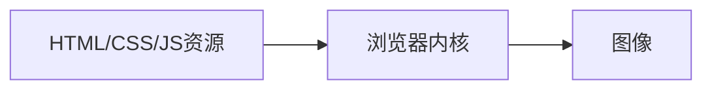
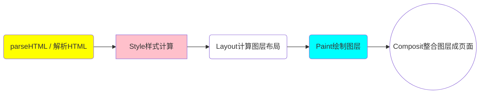
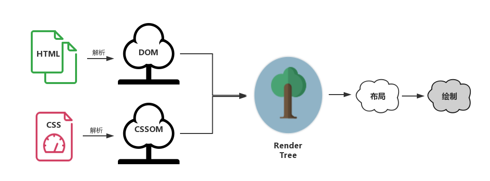

## 浏览器运行机制

开始浏览器端的性能优化

兼容，浏览器的工作原理


### 内核

不同浏览器下代码渲染结果的差异性。

浏览器内核决定了浏览器**解释网页语法**的方式。

浏览器内核可以分成两部分：

* 渲染引擎（Layout Engine 或 Rendering Engine）
* JS引擎

随着JS引擎越来越独立，内核也成了渲染引擎的代称。

渲染引擎又包括：

* HTML解释器
* CSS解释器
* 布局
* 网络
* 存储
* 图形
* 音视频
* 图片解码器
* 等等零部件

常见浏览器内核：

* Trident（IE）
* Gecko（FF）
* Blink（Chrome、Opera）
* Webkit（Safari）

Blink其实是基于Webkit衍生而来的一个分支


本册以Webkit为例，剖析现代浏览器的渲染过程

### 浏览器渲染”黑盒“

什么是渲染过程？渲染引擎根据HTML文件的描述构建相应的数学模型，调用浏览器各个零部件，将网页资源代码转换为图像结果。



浏览器呈现网页的这个过程，浏览器内核的许多功能模块相互配合、协同工作。关键的几个模块：

* HTML解释器：将HTML文档经过词法分析输出DOM树
* CSS解释器：解析CSS文档，生成样式规则
* 图层布局计算模块：布局计算每个对象的精确位置和大小
* 视图绘制模块：进行具体节点的图像绘制，将像素渲染到屏幕上
* JavaScript引擎：编译执行JavaScript代码


### 浏览器渲染过程解析

在浏览器里，每个页面的首次渲染都经历了如下阶段（箭头不代表串行）：



* 解析HTML

  浏览器执行所有的加载解析逻辑，在解析HTML的过程中发出页面渲染所需的各种外部资源请求

* 计算样式

  浏览器识别并加载所有的CSS样式信息与DOM树合并，最终生成页面render树（:after:before等伪元素会在这个环节被构建到DOM树中）

* 计算图层布局

  计算页面中所有元素的相对位置、大小等信息

* 绘制图层

  浏览器会根据DOM代码结果，把每一个页面图层转换为像素，并对所有的媒体文件进行解码

* 整合图层成页面

  浏览器合并各个图层，将数据由CPU输出给GPU最终绘制在屏幕上（复杂的视图层会给这个阶段的GPU计算带来一些压力，在实际应用中为了优化动画性能，有时会手动区分不同的图层？【咋做】）


### 几棵重要的树



* DOM tree：解析HTML后创建DOM树。渲染引擎开始解析HTML文档，转换树中的标签到DOM节点，它被称为“内容树”。
* CSSOM tree：解析CSS（包括外部CSS文件和样式元素）后创建。CSSOM的解析过程和DOM的解析过程是**并行的**。
* 渲染树（render tree）：CSSOM与DOM结合，得到的就是渲染树。
* 布局渲染树：从根节点递归调用，计算每一个元素的大小、位置等，给出每个节点应该出现在屏幕上的精确坐标，此时便得到了基于渲染树的布局渲染树（Layout of render tree）。
* 绘制渲染树：遍历渲染树，每个节点将使用UI后端层来绘制。这整个过程就叫做绘制渲染树（Painting the render tree）。

浏览器以布局渲染树为蓝本，去计算布局并绘制图像，页面的**初次渲染**便大功告成了。

之后每当一个新元素加入到这个DOM树中，浏览器便会通过CSS引擎查遍CSS样式表，找到符合该元素的样式规则**就**应用到该元素上，然后再重新去绘制它。=》查表=》***CSS样式表规则的优化！！***


### 基于渲染流程的CSS优化建议

一个小常识：CSS引擎查找样式表，对每条规则都按照***从右到左***的顺序去匹配。

```css
* {}
```

通配符会匹配所有元素，浏览器必须去遍历每一个元素！

好的CSS选择器书写习惯，可以带来非常可观的性能提升。**一些性能提升的方案**：

* 避免使用通配符，只对需要用到的元素进行选择
* 关注可以通过继承实现的属性，避免重复匹配重复定义
* 少用标签选择器。如果可以，通过类选择器替代
* 不要画蛇添足。id和class选择器不应该被多余的标签选择器拖后腿
* 减少嵌套。后代选择器的开销是最高的，尽量将选择器的深度降到最低（最高不要超过三层？），尽可能使用类来关联每一个标签元素


### 告别阻塞：CSS与JS的加载顺序优化

HTML、CSS与JS，都有**阻塞渲染**的特性。

HTML阻塞天经地义，没有HTML就没有DOM，没有DOM，渲染和优化都是空谈。

* CSS的阻塞

  DOM和CSSOM合力才能构建渲染树。默认情况下，CSS是阻塞的资源。

  浏览器在构建CSSOM的过程中，不会渲染任何已处理的内容，即便DOM已经解析完毕了。=》避免HTML页面裸奔在用户面前

  > 需要将CSS资源尽早、尽快地下载到客户端，以便缩短首次渲染的时间。

  尽早=》放在head标签里，尽快=》启用CDN实现静态资源加载速度的优化

* JS的阻塞

  在首次渲染过程中，JS并不是一个非登场不可的角色——即时页面死气沉沉、毫无交互，JS的作用在于**修改**！内容、样式、响应用户交互。=》**JS的执行**会阻止CSSOM，在不作显示声明的情况下，也会阻塞DOM。

  一个🌰：`browser.html`

  第一次尝试获取id为container的DOM失败，这说明JS执行时阻塞了DOM，后续的DOM无法创建；第二次才成功，这说明脚本块只能找到在它前面构建好的元素。=》“阻塞DOM”得到了验证

  第三个console尝试获取CSS样式，获取到的是在JS代码执行前的背景色，而非后续设定的新样式=》CSSOM也被阻塞了

  **JS引擎是独立于渲染引擎存在的**。JS代码在文档的何处插入，就在何处执行。

  > HTML解析器遇到script标签时，会暂停渲染过程，将控制权交给JS引擎=》等JS引擎运行完毕后，浏览器会把控制权还给渲染引擎，继续CSSOM和DOM的构建。

  JS引擎抢走了渲染引擎的控制权。

  浏览器之所以让JS阻塞其他的活动，是因为它不知道JS会做什么改变，担心如果不阻止后续的操作，会造成混乱。=》但是写JS的人知道=》可以确认一个JS文件的执行时机=》可以通过对它使用defer和async来避免不必要的阻塞

  **外部JS的三种加载方式：**

  * 正常模式：`<script src=""></script>`

    这种情况下，JS会阻塞浏览器，浏览器必须等待js文件加载和执行完毕才能去做其他事情。

  * async模式：`<script async src=""></script>`

    这种模式下，JS**不会阻塞浏览器**做任何其他的事情。它的加载异步的，当它加载结束，JS脚本会**立即执行**。

  * defer模式：`<script defer src=""></script>`

    defer模式下，JS的加载是异步的，执行是**被推迟的**。等整个文档解析完成、DOMContentLoaded事件即将被触发时，被标记了defer的JS文件才会开始依次执行。

  **如何选择？**当脚本与DOM元素和其他脚本之间的依赖关系不强时，会选用async；当脚本依赖于DOM元素和其他脚本的执行结果时，会选用defer。


### 小结

当JS登场时，往往意味着对DOM的操作，DOM操作所导致的性能开销“昂贵”=》雅虎军规：“尽量减少DOM访问”。


###补充

第一次渲染跟EventLoop有关？？？

如果把与DOM元素和其他脚本之间依赖较多的脚本，设置了async模式，会怎么样？加载js是异步的，不会阻塞渲染；但是执行js还是会阻塞渲染。


Chrome：

css可以并行“加载&解析”并阻塞在它后面的js的“执行”，但不会阻塞js的“加载”；

js的“加载&执行”会阻塞后面的js、css的“加载&执行”，但不会阻塞图片资源的“加载”（浏览器的“预扫描”机制？可以提前获取资源）


谷歌开发者社区


body底部的js，在header里面的资源加载完成后，这个js还没有加载完成，浏览器会进行一次提前渲染，从而提前首屏出现时间。


[伪类与伪元素](http://www.alloyteam.com/2016/05/summary-of-pseudo-classes-and-pseudo-elements/)

