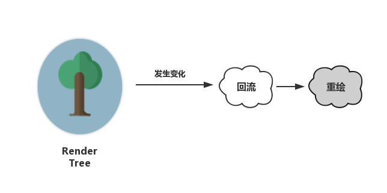

## DOM优化原理与基本实践

DOM为什么这么慢？如何使DOM变快？

根据DOM特性及渲染原理=》基本的优化思路，涉及一部分生产实践

“DOM优化思路”、“异步更新策略”、“回流与重绘”


### DOM为什么这么慢

#### 因为收了“过路费”

> 把DOM和JavaScript各自想象成一个岛屿，它们之间用收费桥梁连接。——高性能JavaScript

JS很快，在JS中修改DOM对象也很快。**但**DOM操作并非JS一个人的独舞，而是两个模块之间的协作。

当我们用JS去操作DOM时，**本质上是JS引擎和渲染引擎之间进行了“跨界交流”**。依赖桥接接口作为“桥梁”。


每操作一次DOM（修改或访问），都要过一次桥。过桥的次数多了，就会产生比较明显的性能问题。=》“减少DOM操作“

#### 对DOM的修改引发样式的更迭

过桥很慢，到了桥对岸，更待操作带来的结果也很慢。

多数时候，对DOM的操作都不会局限于访问，而是为了修改。=》引发DOM外观（样式）上的改变时，就会触发**回流或重绘**。=》本质上还是因为对DOM的修改触发了渲染树（Render Tree）的变化所导致的



* 回流（也叫重排）：对DOM的修改引发了DOM几何尺寸的变化（如宽、高或隐藏元素等）时，浏览器需要重新计算元素的几何属性（其他元素的几何属性和位置也会因此受影响），然后再将计算的结果绘制出来。
* 重绘：对DOM的修改导致了样式的变化、却并未影响其几何属性（如颜色或背景色等）时，浏览器不需要重新计算元素的几何属性、直接为该元素绘制新的样式。

**重绘不一定导致回流，回流一定会导致重绘。**回流做的事情更多，带来的开销也更大。都吃性能=》尽可能把回流和重绘的次数最小化


### 给DOM”提速“

#### 减少DOM操作：少交”过路费“、避免过度渲染

1. **缓存变量**的方式（变量缓存DOM元素）减少过桥次数。

2. **减少不必要的DOM更改**。JS层面的事情处理好了，再去动DOM。JS的运行速度比DOM快得多=》让JS给DOM分压=》[DOM Fragment](https://developer.mozilla.org/zh-CN/docs/Web/API/DocumentFragment)    

   > DocumentFragment接口表示一个没有父级文件的最小文档对象。被当做一个轻量版的Document使用，用于存储已排好版的或尚未打理好格式的XML片段。
   >
   > 因为DocumentFragment不是真实DOM树的一部分，它的变化不会引起DOM树的重新渲染的操作，不会导致性能等问题。

   无论字符串变量还是DOM Fragment，本质上都作为脱离了真实DOM树的**容器**出现，用于缓存批量化的DOM操作。

   DOM Fragment，更优雅，以更加结构化的方式，维持性能的同时，保住代码的可拓展和可维护性。🌰：

   ```javascript
   let container = document.getElementById('container');
   // 创建一个DOM Fragment对象作为容器=》兼容问题
   let content = document.createDocumentFragment();
   for (let count=0; count<10000; count++) {
     // span此时可以通过DOM API去创建
     let oSpan = document.createElement("span");
     oSpan.innerHTML = '我是一个小测试';
     // 像操作真实DOM一样操作DOM Fragment对象
     content.appendChild(oSpan);
   }
   // 内容处理好了，最后再触发真实DOM的更改
   container.appendChild(content);
   ```

   DOM Fragment对象允许我们**像操作真实DOM一样**去调用各种各样的DOM API，代码质量因此得到了保证。它的身份也非常纯粹：当将其append进真实DOM时，会在交出自身缓存的所有的后代节点后**全身而退**，完美地完成一个容器的使命，而不会出现在真实的DOM结构中。（jQuery、Vue等）


#### 补充

利用缓冲的思想减少多次操作引起的性能开销问题

createDocumentFragment适用于子元素没有父元素的情况，如果子元素有一个父元素，直接createElement父元素然后append就可以了

实际数据结构复杂，数量多会阻塞，考虑分批循环，如：只渲染可视区域的dom

变量的缓存对dom重绘没有本质影响，缓存变量还会使脚本大小增加，多次重绘变成一次重绘，才是一优化的实质。既要关注重绘带来的耗时，也要关注脚本大小带来的影响。？

