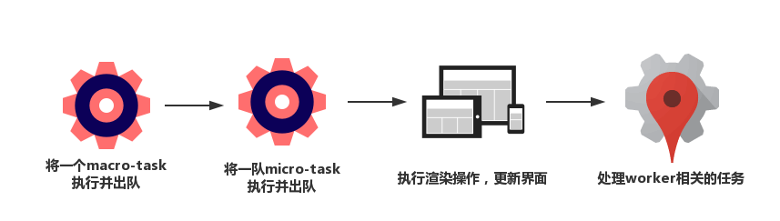

## Event Loop与异步更新策略

异步更新策略：减少DOM操作、避免过度渲染

研究框架的运行机制，其**设计思路**将深化我们对DOM优化的理解，其**实现手法**将拓宽我们对DOM实践的认知。

本节基于Event Loop机制，探讨Vue的异步更新策略。


### *Event Loop中的”渲染时机”

####Micro-Task Vs. Macro-Task

事件循环中的异步队列有两种：macro（宏任务）队列和micro（微任务）队列。

常见的macro-task：setTimeout, setInterval, setImmediate, script（整体代码）, I/O操作, UI渲染等 ajax里的回调函数

常见的micro-task：process.nextTick, Promise, MutationObserver等

####Event Loop过程解析

一个完整的Event Loop过程，可以概括为以下阶段：

* 初始状态：**调用栈空**。micro队列空，marco队列里有且仅有一个script脚本（整体代码）

* **全局上下文（script标签）被推入调用栈**，同步代码执行。

  在***执行过程中***，通过对一些接口的调用，可以产生新的macro-task与micro-task，会分别被推入各自的任务队列里。

  同步代码***执行完了***，script脚本会被移除macro队列，**这个过程本质上是队列的macro-task的执行和出队的过程。**

* 上一步出队的是一个macro-task，这一步我们处理的是micro-task。

  **注：**macro-task出队时，任务是一个一个执行的；而micro-task出队时，任务是一队一队执行的。

  处理micro队列这一步，会逐个执行队列中的任务并把它出队，直到队列被清空。

* **执行渲染操作，更新界面**。

* 检查是否存在Web worker任务，如果有，则对其进行处理。

上述过程循环往复，直到两个队列都清空。



####渲染的时机

在异步任务里进行DOM更新，该把它包装成micro还是macro呢？

更新DOM的时间点，应该尽可能靠近渲染的时机。

**当我们需要在异步任务中实现DOM修改时，把它包装成micro任务是相对明智的选择。**（执行script脚本->处理micro-task->(DOM修改完成)->render）

```javascript
// macro-task
setTimeout(task, 0);
// micro-task
Promise.resolve().then(task);
```


### *生产实践：异步更新策略——以Vue为例

什么是异步更新？

当使用Vue或React提供的接口去更新数据时，这个更新并不会立即生效，而是会被推入到一个队列里。等到适当的时机，队列中的更新任务会被**批量触发**。

异步更新可以帮助**避免过度渲染**，即“让JS为DOM分压”的典范之一。

#### 异步更新的优越性

异步更新的特性在于**只看结果**，因此渲染引擎**不需要为过程买单**。

在JS的层面上被**批量执行完毕**。当流程走到渲染这一步时，仅仅需要针对有意义的计算结果**操作一次DOM**——这就是异步更新的妙处。

#### Vue状态更新手法：nextTick

Vue每次想要更新一个状态的时候，会先把它这个更新操作给包装成一个异步操作派发出去。这个事情，在源码中由一个叫做nextTick的函数来完成：

```javascript
export function nextTick (cb?:Function, ctx?: Object) { // 使用flow进行静态类型检查，flow语法，代表可选参数
  let _resolve;
  callbacks.push(() => {
    if (cb) {
      try {
        cb.call(ctx);
      } catch(e) {
        handleError(e, ctx, 'nextTick');
      }
    } else if (_resolve) {
      _resolve(ctx);
    }
  });
  // 检查上一个异步任务队列（即名为callbacks的任务数组）是否派发和执行完毕了。pending此处相当于一个锁
  if (!pending) {
    // 若上一个异步任务队列已经执行完毕，则将pending设定为true（把锁锁上）
    pending = true;
    // 是否要求一定要派发为macro任务
    if (useMacroTask) {
      macroTimerFunc();
    } else {
      // 如果不说明一定要macro，就默认为micro
      microTimerFunc();
    }
  }
  // $flow-disable-line
  if (!cb && typeof Promise !== 'undefined') {
    return new Promise(resolve => {
      _resolve = resolve;
    });
  }
}
```

可以看到，Vue的异步任务默认情况下都是用Promise来包装的，即它们都是micro-task。

无论是派发marco任务还是micro任务，派发的任务对象都是一个叫做flushCallbacks的东西。

```javascript
function flushCallbacks () {
  pending = false;
  // callbacks在nextTick中出现过，是任务数组（队列）
  const copies = callbacks.slice(0);
  callback.length = 0;
  // 将callbacks中的任务逐个取出执行
  for (let i = 0; i < copies.length; i++) {
    copies[i]();
  }
}
```

**如果当下pending锁是关的，cb被推入callback数组，要等待下一次异步更新任务才会执行？？**


### *小结

DOM操作也分很多种，带来的变化各不相同。重绘？回流？


#### 补充

[Event Loop](https://juejin.im/post/6844904050543034376)

浏览器的绘制最小间隔16ms

[Vue.nextTick的使用动机](https://cn.vuejs.org/v2/api/#Vue-nextTick)，在同一事件循环中的数据变化后，DOM完成更新（未渲染？），就会执行Vue.nextTick()的回调

