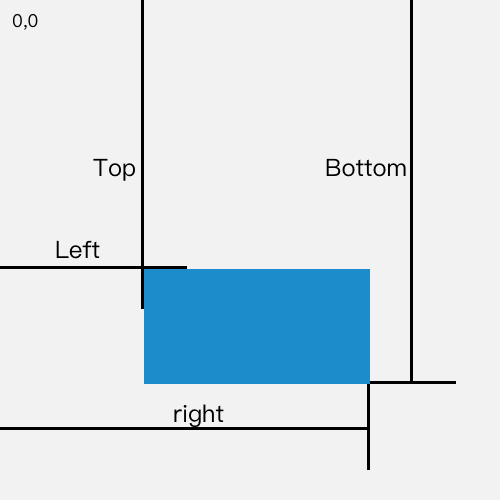

## 应用篇1：优化首屏体验——Lazy-Load

### Lazy-Load初见

是针对图片加载时机的优化。（图片量比较大时，如电商首页、小游戏首页等，在用户打开页面时就把所有图片资源加载完毕，很可能会造成白屏、卡顿）

=》用户点开页面的瞬间，呈现的只有屏幕的一部分（首屏）：下面的图片可以等用户下拉的瞬间再即时去请求、即时呈现

[掘金首页](https://juejin.im/)

淘宝首页的HTML Preview。

”占位“，”骨架屏“，用大大小小的空div元素来占位。一但通过滚动使得这个div出现在了可见范围内，那么div元素的内容就会发生变化——被写入了有效的图片URL，图片才得以呈现。


### 写一个Lazy-Load

```
lazyload
|
|----images
|----index.html
```

懒加载的实现中的两个关键数值：

一个是当前**可视区域的高度**，另一个是元素**距离可视区域顶部**的高度。

* 获取**当前可视区域的高度**，在现代浏览器及IE9+浏览器中，可使用window.innerHeight属性获取；在低版本IE的标准模式中，可使用document.documentElement.clientHeight获取。

* 获取元素距离可视区域顶部的高度，这里选用getBoundingClientRect()方法来获取返回元素的大小及其相对于视口的位置。

  > getBoundingClientRect()方法的返回值是一个DOMRect对象，这个对象是由该元素的getClientRects()方法返回的一组矩形的集合，即：是与该元素相关的CSS边框集合。

  > DOMRect对象包含了一组用于描述边框的只读属性——Left、top、right和bottom，单位为像素。除了width和height外的属性，都是相对于视口的左上角位置而言的。

  

  可以看到，top属性代表了元素距离可视区域顶部的高度！！


### 小结

scroll事件容易被触发！频繁地响应某个事件将造成大量不必要的页面计算


**补充：**

img标签自带的loading属性，InsectionObserver？Intersection-Observer？

新append进来的img元素也要绑定上lazyload

监听之前要先执行以下lazyload？

骨架屏：在基本的HTML中加入一些额外的HTML和css，js加载完后再覆盖

