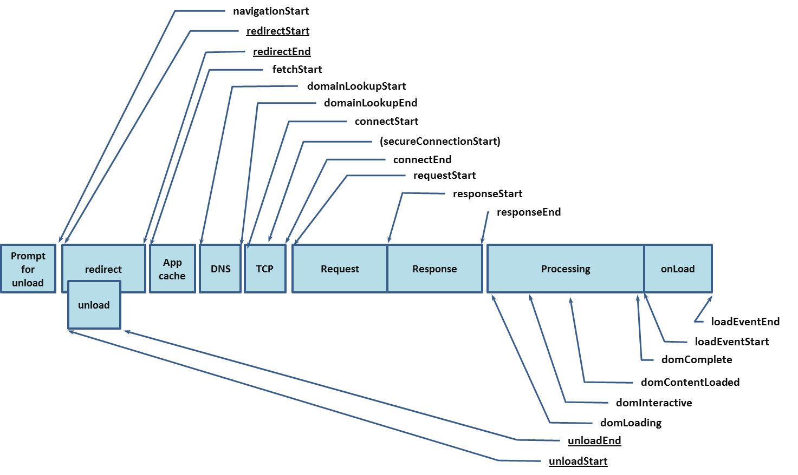

## 性能监测：Performance、Lighthouse、性能API

性能监测目的：为了确定性能瓶颈，从而有的放矢地开展具体的优化工作。

性能监测方案主要有两种：可视化方案、可编程方案


### 可视化监测：Chrome的Performance面板

用于记录和分析我们的应用在运行时的所有活动。

呈现的数据具有实时性、多维度的特点，可以帮助我们很好地定位性能问题。

tips：为了规避其他Chrome插件对页面的性能影响，最好在**无痕模式**下打开页面

####简要分析：

从上到下，依次为概述面板、详情面板

概述面板：右上角的三个栏目：FPS、CPU、NET

* FPS：**一个和动画性能密切相关的指标，表示每一秒的帧数。**绿色柱状越高表示帧率越高，体验就越流畅；若出现红色块，则代表长时间帧，很可能会出现卡顿。
* CPU：**表示CPU的使用情况，不同的颜色片段代表着消耗CPU资源的不同事件类型**。这部分图像和详情面板中的Summary内容有对应关系。——可以结合这两者挖掘性能瓶颈。
* NET：粗略的展示了各请求的耗时与前后顺序。这个指标一般来说帮助不大。

#### 挖掘性能瓶颈：

一般来说，主要看Main栏目下的火焰图和Summary提供的饼图——这两者和概述面板中的CPU一栏结合，可以迅速定位性能瓶颈。

首先CPU图表和Summary饼图。CPU图表中，可以根据颜色填充的饱满程度，**确定CPU的忙闲**，进而了解该页面的总的任务量；而Summary饼图则以一种直观的方式告诉我们，**哪个类型的任务最耗时**。——这样就可以抓到”主要矛盾“。

在看Main下面的**火焰图。它展示了整个运行时主进程所做的每一件事情**（包括加载、脚本运行、渲染、布局、绘制等）。**x轴**表示随时间的记录：每个长条就代表一个活动，更宽的条形意味着事件需要更长时间。**y轴**表示调用堆栈，事件是相互堆叠的，上层的事件触发了下层的事件。

**CPU图和Summary图都是按照”类型“给我们提供性能信息，而火焰图则将粒度细化到了每一个函数的调用。**——到底是从哪个过程开始出问题、是哪个函数拖了后腿、又是哪个事件触发了这个函数。


### 可视化监测：更聪明的LightHouse

Performance的展示作用大于分析作用。要求使用者对工具本身及其所展示的信息有充分的理解——能够将晦涩的数据”翻译“成具体的性能问题。

> Lighthouse是一个开源的自动化工具，用于改进网络应用的质量。
>
> 可以将其作为一个Chrome扩展程序运行，或从命令行运行。
>
> 为Lighthouse提供一个需要审查的网址，它将针对此页面运行一连串的测试，然后生成一个有关页面性能的报告。

Generate report。

分类指标跑分，每一个指标的细化评估，Opportunities中针对性能问题给出可行的建议、以及每一项 优化操作预期节省的时间。——可操作性很强

除了直接下载，还可以通过命令行使用LightHouse：

```shell
npm install lighthouse -g
lighthouse https://juejin.im/books
```

从Chrome60开始，DevTools中直接加入了基于LightHouse的Audits面板


### 可编程的性能上报方案：W3C性能API

W3C提供了Performance相关的接口。允许获取到用户访问一个页面的每个阶段的精确时间，从而对性能进行分析。=》可理解为Performance面板的进一步细化与可编程化

=》Performance面板就是数据可视化的典范

很多情况下，后端也需要我们提供性能信息的上报。此外，Performance提供的可视化结果并不一定能够满足我们实际的业务需求

#### 访问performance对象

是一个全局对象。window.performance

#### 关键时间节点

performance的timing属性。

这些时间戳与页面整个加载流程中的关键时间节点有着一一对应的关系：



通过求两个时间点之间的差值，可以得出**某个过程花费的时间**，如：

```javascript
const timing = window.performance.timing;
// DNS查询耗时
timing.domainLookupEnd - timing.domainLookupStart;

// TCP连接耗时
timing.connectEnd - timing.connectStart;

// 内容加载耗时
timing.responseEnd - timing.requestStart;
```

除了常见的耗时情况，还应该关注一些**关键性能指标**：firstbyte、fpt、tti、ready、load等。这些指标数据与真实的用户体验息息相关，是日常业务性能监测中不可或缺的一部分：

```javascript
// firstbyte: 首包时间
tming.responseStart - timing.domainLookupStart

// fpt: First Paint Time, 首次渲染时间/白屏时间
timing.responseEnd - timing.fetchStart

// tti: Time to Interact，首次可交互时间
timing.domInteractive - timing.fetchStart

// ready: HTML加载完成时间，即DOM就位的时间
timing.domContentLoaded - timing.fetchStart

// load: 页面完全加载时间
timing.loadEventStart - timing.fetchStart
```

通过Performance API获取到的时间信息都具有**较高的准确度**。=》上报给服务端后可以基于此去制作相应的统计图表=》实现*更加精准、更加个性化*的性能耗时统计

通过访问performance的memory属性（Chrome添加的非标准扩展），还可以获取到内存占用相关的数据；通过对其他属性方法的灵活运用，还可以耦合进业务实现更加多样化的性能监测需求。——灵活


### 小结

性能监测的复杂度是在与业务发生耦合的过程中提升的。

相关文档：

[Performance官方文档](https://developers.google.com/web/tools/chrome-devtools/evaluate-performance/reference)

[使用LightHouse审查网络应用](https://developers.google.com/web/tools/lighthouse/?hl=zh-cn)

[MDN Performance API介绍](https://developer.mozilla.org/zh-CN/docs/Web/API/Performance)


其他

preformance.timing怎么与spa应用结合使用

window.performance.timing中的一些值是动态修正的？所以想要获取准确的timing值需要在一些事件后（DOMContentLoaded?）